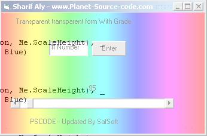



## A transparent Form with colors &amp; chosse trans Version1

### Description

This can be good for some body want to make transparent Form &amp; choose the grade and some colors that grade in the background ..

check the screen shot for the idea .. and if you like this i'll make version 2 , please rate and write your ideas ..
 
### More Info
 
this is not cure to have side effects

             |
---                |---
**Submitted On**   |2000-05-11 18:47:10
**By**             |[Sharif aly Fouad](https://github.com/Planet-Source-Code/PSCIndex/blob/master/ByAuthor/sharif-aly-fouad.md)
**Level**          |Beginner
**User Rating**    |4.8 (24 globes from 5 users)
**Compatibility**  |VB 6\.0
**Category**       |[Graphics](https://github.com/Planet-Source-Code/PSCIndex/blob/master/ByCategory/graphics__1-46.md)
**World**          |[Visual Basic](https://github.com/Planet-Source-Code/PSCIndex/blob/master/ByWorld/visual-basic.md)
**Archive File**   |[A\_transpar16829412122003\.zip](https://github.com/Planet-Source-Code/sharif-aly-fouad-a-transparent-form-with-colors-amp-chosse-trans-version1__1-50415/archive/master.zip)

